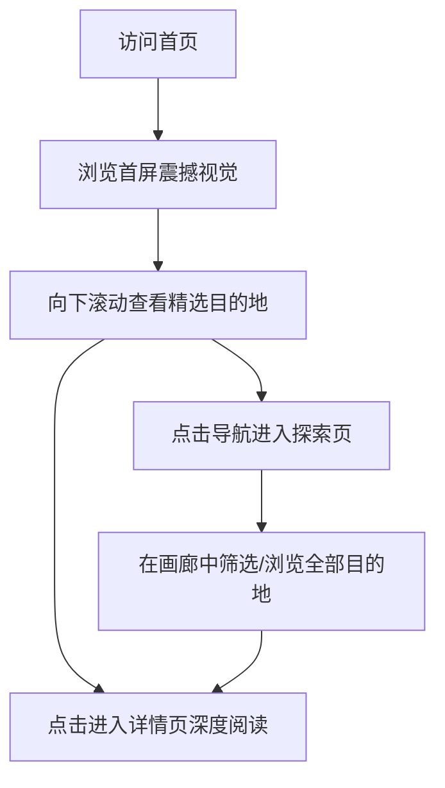

## 1. 产品概述
本项目名为“留白 - 中国鲜为人知的美”（Blank Space - China's Little-Known Beauty），是一个旨在向海外用户展示中国小众、绝美自然风景与人文秘境的宣传系统。
项目采用极简、高级的东方美学设计语言，结合现代化的前端交互技术（如视差滚动、沉浸式大图展示、流畅转场），打破传统旅游网站的刻板印象，激发海外用户的探索欲。

## 2. 核心功能

### 2.1 用户角色
| 角色 | 注册方式 | 核心权限 |
|------|----------|----------|
| 访客 | 无需注册 | 浏览所有图文内容、沉浸式交互体验、查看目的地指引 |

### 2.2 功能模块
1. **首页 (Home)**：全屏Hero沉浸式图文轮播，东方美学留白排版，核心版块导航（自然秘境、人文遗迹、非遗传承）。
2. **探索页 (Explore)**：瀑布流或横向画廊式浏览，支持按地域或主题分类筛选。
3. **详情页 (Detail)**：如同电子杂志般的图文排版，大面积留白，包含地理位置、文化背景故事、绝美图集。

### 2.3 页面详情
| 页面名称 | 模块名称 | 功能描述 |
|----------|----------|----------|
| 首页 | 沉浸式首屏 | 全屏背景，极简标题，滚动提示符，展示东方意境 |
| 首页 | 精选推荐 | 以非对称卡片布局展示3-4个代表性目的地，突出高级感 |
| 探索页 | 视觉画廊 | 瀑布流展示各地的风景缩略图，悬浮显示地名（中英文对照） |
| 详情页 | 深度阅读 | 包含目的地头图、故事正文、路线提示及相关推荐，大面积留白 |

## 3. 核心流程
用户主要通过视觉引导进行探索式浏览。

## 4. 用户界面设计

### 4.1 设计风格
- **主色调**：以黑、白、灰及米白色（纸张质感）为基底，搭配中国传统色（如青绿、石青、朱砂）作为点缀。
- **字体**：标题采用具有现代东方韵味的无衬线或优雅的衬线体，正文采用阅读体验良好的现代无衬线体（支持多语言显示）。
- **布局风格**：大面积留白，打破传统网格的非对称排版，像高端时尚/艺术杂志。
- **动效**：使用优雅的淡入淡出、缓慢缩放、视差滚动（Parallax），避免剧烈弹跳。

### 4.2 页面设计概述
| 页面名称 | 模块名称 | UI 元素 |
|----------|----------|---------|
| 首页 | 首屏Hero | 高清背景图/视频，居中极简中英文标题，半透明渐变遮罩 |
| 探索页 | 画廊 | 悬停时图片缓慢放大并显示文字描述，无边框卡片 |
| 详情页 | 正文区 | 宽幅横图与窄幅文字交错，大量留白，精致的引言排版 |

### 4.3 响应式设计
采用桌面端优先（Desktop-first）设计，兼顾移动端适配。移动端将非对称布局自动转换为单列流式布局，优化触控手势（如横向滑动图集）。
