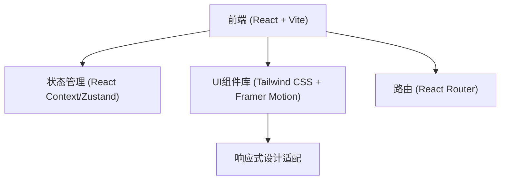
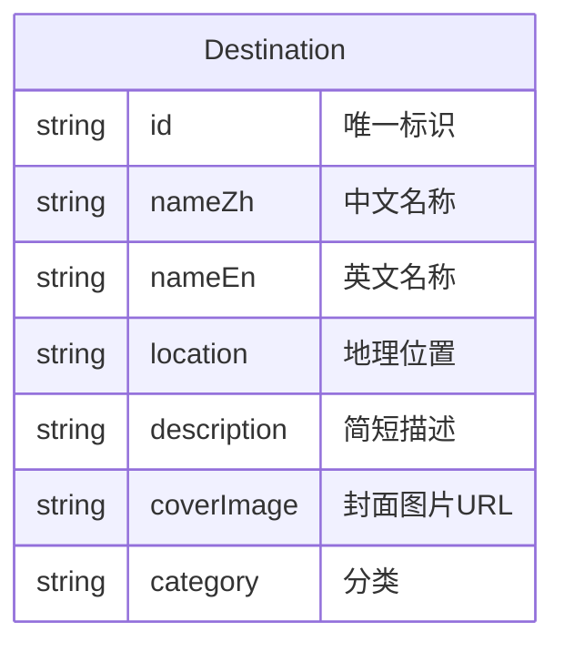

## 1. 架构设计



## 2. 技术说明
- **前端框架**: React 18 + Vite
- **样式方案**: Tailwind CSS 3 (用于原子化样式和快速响应式布局)
- **动画库**: Framer Motion (用于复杂的页面转场、视差滚动和优雅的进入动画)
- **图标库**: Lucide React
- **初始化工具**: npm create vite@latest
- **数据来源**: 纯前端项目，数据采用 Mock 静态 JSON 数据（包含目的地的高清图片链接、多语言描述）。

## 3. 路由定义

| 路由 | 用途 |
|------|------|
| `/` | 首页，展示核心品牌形象和精选目的地 |
| `/explore` | 探索页，全部目的地的瀑布流/画廊展示 |
| `/detail/:id` | 详情页，展示特定目的地的深度内容 |

## 4. API Definitions
由于是纯前端静态展示网站，无需真实的后端 API。数据由本地 TypeScript 对象提供，模拟数据拉取过程。

```typescript
type Destination = {
  id: string;
  nameZh: string;
  nameEn: string;
  location: string;
  description: string;
  longDescription: string;
  images: string[];
  coverImage: string;
  category: 'nature' | 'culture' | 'heritage';
}
```

## 5. Data Model
暂无后端数据库，以下为前端 Mock 数据的关系说明：

### 5.1 数据模型定义


